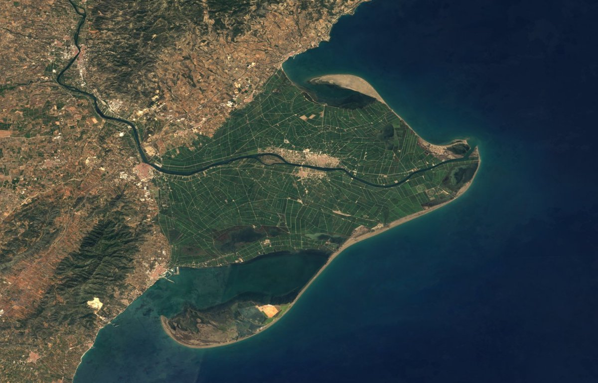

```{python}
from pathlib import Path
from urllib.parse import urlencode
from urllib.request import Request, urlopen

output = Path("assets/img/aerial-photography/sentinel2-cloudless-delta-ebre-eox-2016.jpg")
output.parent.mkdir(parents=True, exist_ok=True)

params = {
    "SERVICE": "WMS",
    "VERSION": "1.1.1",
    "REQUEST": "GetMap",
    "LAYERS": "s2cloudless",
    "STYLES": "",
    "SRS": "EPSG:4326",
    "BBOX": "0.45,40.52,0.98,40.86",
    "WIDTH": "1200",
    "HEIGHT": "770",
    "FORMAT": "image/jpeg",
}

def is_jpeg(path):
    return path.exists() and path.read_bytes()[:2] == b"\xff\xd8"


url = "https://tiles.maps.eox.at/map?" + urlencode(params)

if not is_jpeg(output):
    request = Request(url, headers={"User-Agent": "TIGIT manual figure builder"})
    with urlopen(request, timeout=60) as response:
        content_type = response.headers.get("Content-Type", "")
        data = response.read()

    if "image" not in content_type.lower() or not data.startswith(b"\xff\xd8"):
        raise RuntimeError(f"The WMS response is not a JPEG image: {content_type}")

    output.write_bytes(data)

if not is_jpeg(output):
    raise RuntimeError(f"Missing or invalid image output: {output}")
```


