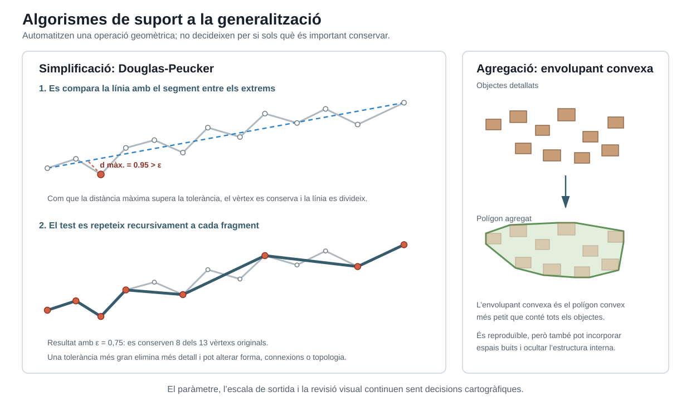

```{python}
from html import escape
from math import hypot
from pathlib import Path


def find_project_root(start):
    path = Path(start).resolve()
    for candidate in (path, *path.parents):
        if (candidate / ".unaltraweb" / "computations.yml").is_file():
            return candidate
    raise RuntimeError("Project root not found: missing .unaltraweb/computations.yml")


def perpendicular_projection(point, start, end):
    dx = end[0] - start[0]
    dy = end[1] - start[1]
    if dx == 0 and dy == 0:
        return start, hypot(point[0] - start[0], point[1] - start[1])
    position = ((point[0] - start[0]) * dx + (point[1] - start[1]) * dy) / (dx * dx + dy * dy)
    position = max(0.0, min(1.0, position))
    projection = (start[0] + position * dx, start[1] + position * dy)
    return projection, hypot(point[0] - projection[0], point[1] - projection[1])


def douglas_peucker(points, tolerance):
    if len(points) <= 2:
        return points
    distances = [perpendicular_projection(point, points[0], points[-1])[1] for point in points[1:-1]]
    max_distance = max(distances)
    max_index = distances.index(max_distance) + 1
    if max_distance <= tolerance:
        return [points[0], points[-1]]
    left = douglas_peucker(points[: max_index + 1], tolerance)
    right = douglas_peucker(points[max_index:], tolerance)
    return left[:-1] + right


def convex_hull(points):
    ordered = sorted(set(points))
    if len(ordered) <= 1:
        return ordered

    def cross(origin, a, b):
        return (a[0] - origin[0]) * (b[1] - origin[1]) - (a[1] - origin[1]) * (b[0] - origin[0])

    lower = []
    for point in ordered:
        while len(lower) >= 2 and cross(lower[-2], lower[-1], point) <= 0:
            lower.pop()
        lower.append(point)

    upper = []
    for point in reversed(ordered):
        while len(upper) >= 2 and cross(upper[-2], upper[-1], point) <= 0:
            upper.pop()
        upper.append(point)
    return lower[:-1] + upper[:-1]


def points_attribute(points):
    return " ".join(f"{x:.1f},{y:.1f}" for x, y in points)


source_line = [
    (0.0, 1.0),
    (0.8, 1.6),
    (1.5, 0.6),
    (2.2, 2.3),
    (3.0, 2.8),
    (3.8, 2.0),
    (4.5, 3.6),
    (5.4, 3.0),
    (6.1, 4.5),
    (7.0, 3.9),
    (7.8, 4.8),
    (8.7, 3.8),
    (10.0, 5.2),
]
tolerance = 0.75
simplified_line = douglas_peucker(source_line, tolerance)

first_distances = [perpendicular_projection(point, source_line[0], source_line[-1]) for point in source_line[1:-1]]
farthest_offset = max(range(len(first_distances)), key=lambda index: first_distances[index][1])
farthest_index = farthest_offset + 1
farthest_point = source_line[farthest_index]
farthest_projection, farthest_distance = first_distances[farthest_offset]


def line_to_svg(points, baseline_y):
    return [(85 + x * 64, baseline_y - y * 28) for x, y in points]


stage_one = line_to_svg(source_line, 330)
stage_two = line_to_svg(source_line, 585)
simplified_stage = line_to_svg(simplified_line, 585)
farthest_svg = line_to_svg([farthest_point], 330)[0]
projection_svg = line_to_svg([farthest_projection], 330)[0]

houses = [
    (872, 214, 27, 19),
    (915, 199, 30, 21),
    (961, 225, 25, 18),
    (1001, 195, 31, 22),
    (1046, 236, 27, 19),
    (1091, 210, 28, 20),
    (925, 257, 28, 19),
    (975, 269, 31, 20),
    (1031, 274, 27, 19),
    (1080, 260, 30, 20),
]
shift_y = 205
aggregate_houses = [(x, y + shift_y, width, height) for x, y, width, height in houses]
house_corners = []
for x, y, width, height in aggregate_houses:
    house_corners.extend([(x, y), (x + width, y), (x + width, y + height), (x, y + height)])
hull = convex_hull(house_corners)

width = 1240
height = 720
svg = [
    f'<svg xmlns="http://www.w3.org/2000/svg" width="{width}" height="{height}" viewBox="0 0 {width} {height}" role="img" aria-labelledby="title desc">',
    '  <title id="title">Douglas-Peucker i envolupant convexa en la generalització cartogràfica</title>',
    '  <desc id="desc">El panell esquerre mostra com la distància perpendicular màxima i una tolerància determinen els vèrtexs conservats per Douglas-Peucker. El panell dret calcula el polígon convex mínim que conté un grup d’habitatges.</desc>',
    '  <defs>',
    '    <style>',
    "      .bg { fill: #ffffff; }",
    "      .card { fill: #ffffff; stroke: #cbd6db; stroke-width: 1.6; }",
    "      .title { font: 700 28px Arial, 'Liberation Sans', sans-serif; fill: #17202a; }",
    "      .subtitle { font: 16px Arial, 'Liberation Sans', sans-serif; fill: #52616b; }",
    "      .heading { font: 700 21px Arial, 'Liberation Sans', sans-serif; fill: #17202a; }",
    "      .stage { font: 700 16px Arial, 'Liberation Sans', sans-serif; fill: #365b6d; }",
    "      .body { font: 14px Arial, 'Liberation Sans', sans-serif; fill: #52616b; }",
    "      .note { font: 700 14px Arial, 'Liberation Sans', sans-serif; fill: #8c3225; }",
    "      .source { fill: none; stroke: #aeb8bf; stroke-width: 3; stroke-linecap: round; stroke-linejoin: round; }",
    "      .baseline { fill: none; stroke: #2c83c5; stroke-width: 2.4; stroke-dasharray: 8 6; }",
    "      .result { fill: none; stroke: #365b6d; stroke-width: 5; stroke-linecap: round; stroke-linejoin: round; }",
    "      .vertex { fill: #ffffff; stroke: #6f7d85; stroke-width: 1.5; }",
    "      .kept { fill: #d65f43; stroke: #8c3225; stroke-width: 1.5; }",
    "      .distance { fill: none; stroke: #d65f43; stroke-width: 2.2; stroke-dasharray: 5 4; }",
    "      .house { fill: #c99d75; stroke: #8b6548; stroke-width: 1.4; }",
    "      .house-faded { fill: #c99d75; stroke: #8b6548; stroke-width: 1.2; opacity: .45; }",
    "      .hull { fill: #dce9d3; fill-opacity: .78; stroke: #5f9259; stroke-width: 3; stroke-linejoin: round; }",
    '    </style>',
    '    <marker id="arrow" markerWidth="10" markerHeight="10" refX="8" refY="3" orient="auto" markerUnits="strokeWidth">',
    '      <path d="M0,0 L0,6 L9,3 z" fill="#365b6d"/>',
    '    </marker>',
    '  </defs>',
    f'  <rect class="bg" width="{width}" height="{height}"/>',
    '  <text x="40" y="44" class="title">Algorismes de suport a la generalització</text>',
    '  <text x="40" y="69" class="subtitle">Automatitzen una operació geomètrica; no decideixen per si sols què és important conservar.</text>',
    '  <rect x="40" y="92" width="760" height="578" rx="10" class="card"/>',
    '  <text x="70" y="130" class="heading">Simplificació: Douglas-Peucker</text>',
    '  <text x="70" y="164" class="stage">1. Es compara la línia amb el segment entre els extrems</text>',
    f'  <polyline points="{points_attribute(stage_one)}" class="source"/>',
    f'  <line x1="{stage_one[0][0]:.1f}" y1="{stage_one[0][1]:.1f}" x2="{stage_one[-1][0]:.1f}" y2="{stage_one[-1][1]:.1f}" class="baseline"/>',
    f'  <line x1="{farthest_svg[0]:.1f}" y1="{farthest_svg[1]:.1f}" x2="{projection_svg[0]:.1f}" y2="{projection_svg[1]:.1f}" class="distance"/>',
]

for x, y in stage_one:
    svg.append(f'  <circle cx="{x:.1f}" cy="{y:.1f}" r="4.2" class="vertex"/>')
svg.extend([
    f'  <circle cx="{farthest_svg[0]:.1f}" cy="{farthest_svg[1]:.1f}" r="6" class="kept"/>',
    f'  <text x="{(farthest_svg[0] + projection_svg[0]) / 2 + 10:.1f}" y="{(farthest_svg[1] + projection_svg[1]) / 2:.1f}" class="note">d màx. = {farthest_distance:.2f} &gt; ε</text>',
    '  <text x="85" y="361" class="body">Com que la distància màxima supera la tolerància, el vèrtex es conserva i la línia es divideix.</text>',
    '  <text x="70" y="410" class="stage">2. El test es repeteix recursivament a cada fragment</text>',
    f'  <polyline points="{points_attribute(stage_two)}" class="source"/>',
    f'  <polyline points="{points_attribute(simplified_stage)}" class="result"/>',
])

for x, y in stage_two:
    svg.append(f'  <circle cx="{x:.1f}" cy="{y:.1f}" r="3.6" class="vertex"/>')
for x, y in simplified_stage:
    svg.append(f'  <circle cx="{x:.1f}" cy="{y:.1f}" r="5.5" class="kept"/>')

svg.extend([
    f'  <text x="85" y="620" class="body">Resultat amb ε = 0,75: es conserven {len(simplified_line)} dels {len(source_line)} vèrtexs originals.</text>',
    '  <text x="85" y="646" class="body">Una tolerància més gran elimina més detall i pot alterar forma, connexions o topologia.</text>',
    '  <rect x="830" y="92" width="370" height="578" rx="10" class="card"/>',
    '  <text x="855" y="130" class="heading">Agregació: envolupant convexa</text>',
    '  <text x="855" y="158" class="body">Objectes detallats</text>',
])

for x, y, house_width, house_height in houses:
    svg.append(f'  <rect x="{x}" y="{y}" width="{house_width}" height="{house_height}" class="house"/>')

svg.extend([
    '  <line x1="1015" y1="315" x2="1015" y2="372" stroke="#365b6d" stroke-width="2.5" marker-end="url(#arrow)"/>',
    '  <text x="855" y="397" class="body">Polígon agregat</text>',
    f'  <polygon points="{points_attribute(hull)}" class="hull"/>',
])

for x, y, house_width, house_height in aggregate_houses:
    svg.append(f'  <rect x="{x}" y="{y}" width="{house_width}" height="{house_height}" class="house-faded"/>')

svg.extend([
    '  <text x="855" y="552" class="body">L’envolupant convexa és el polígon convex</text>',
    '  <text x="855" y="574" class="body">més petit que conté tots els objectes.</text>',
    '  <text x="855" y="607" class="body">És reproduïble, però també pot incorporar</text>',
    '  <text x="855" y="629" class="body">espais buits i ocultar l’estructura interna.</text>',
    '  <text x="620" y="704" text-anchor="middle" class="subtitle">El paràmetre, l’escala de sortida i la revisió visual continuen sent decisions cartogràfiques.</text>',
    '</svg>',
])

root = find_project_root(Path.cwd())
output = root / "assets/img/cartographic-language/generalization-algorithms.svg"
output.parent.mkdir(parents=True, exist_ok=True)
output.write_text("\n".join(svg) + "\n", encoding="utf-8")
```


