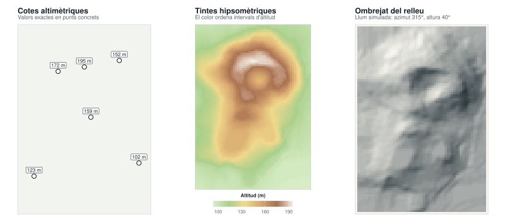
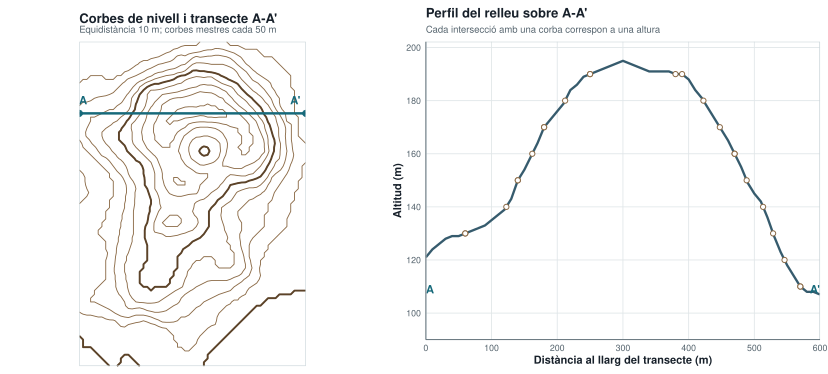

```{r}
find_project_root <- function(start) {
  path <- normalizePath(start, winslash = "/", mustWork = FALSE)
  repeat {
    if (file.exists(file.path(path, ".unaltraweb", "computations.yml"))) {
      return(path)
    }
    parent <- dirname(path)
    if (identical(parent, path)) {
      stop("Project root not found: missing .unaltraweb/computations.yml")
    }
    path <- parent
  }
}

xml_escape <- function(value) {
  value <- gsub("&", "&amp;", value, fixed = TRUE)
  value <- gsub("<", "&lt;", value, fixed = TRUE)
  value <- gsub(">", "&gt;", value, fixed = TRUE)
  value
}

add_svg_metadata <- function(path, title, description) {
  lines <- readLines(path, warn = FALSE, encoding = "UTF-8")
  svg_line <- grep("^<svg", lines)[1]
  stopifnot(!is.na(svg_line))
  lines[svg_line] <- sub(
    "<svg ",
    '<svg role="img" aria-labelledby="title desc" ',
    lines[svg_line],
    fixed = TRUE
  )
  metadata <- c(
    sprintf('  <title id="title">%s</title>', xml_escape(title)),
    sprintf('  <desc id="desc">%s</desc>', xml_escape(description))
  )
  lines <- append(lines, metadata, after = svg_line)
  writeLines(lines, path, useBytes = TRUE)
}

root <- find_project_root(getwd())
suppressPackageStartupMessages(library(ggplot2))
suppressPackageStartupMessages(library(terra))

# R distribueix aquesta matriu d'altituds a una malla regular de 10 m.
elevation <- datasets::volcano
cell_size <- 10
dem <- terra::rast(
  nrows = nrow(elevation),
  ncols = ncol(elevation),
  xmin = 0,
  xmax = ncol(elevation) * cell_size,
  ymin = 0,
  ymax = nrow(elevation) * cell_size
)
terra::values(dem) <- as.vector(t(elevation))
names(dem) <- "elevation"

slope <- terra::terrain(dem, "slope", unit = "radians", neighbors = 8)
aspect <- terra::terrain(dem, "aspect", unit = "radians", neighbors = 8)
hillshade <- terra::shade(slope, aspect, angle = 40, direction = 315, normalize = TRUE)
names(hillshade) <- "hillshade"

terrain <- as.data.frame(c(dem, hillshade), xy = TRUE, na.rm = FALSE)
terrain$elevation <- as.numeric(terrain$elevation)
terrain$hillshade <- as.numeric(terrain$hillshade)

base_theme <- theme_void(base_size = 11) +
  theme(
    plot.title = element_text(face = "bold", size = 13, color = "#17202a", hjust = 0),
    plot.subtitle = element_text(size = 9.5, color = "#52616b", hjust = 0, margin = margin(b = 7)),
    panel.border = element_rect(fill = NA, color = "#c7d2d7", linewidth = 0.55),
    plot.margin = margin(8, 8, 8, 8),
    legend.position = "bottom",
    legend.title = element_text(size = 8.5, face = "bold", color = "#17202a"),
    legend.text = element_text(size = 8, color = "#52616b"),
    legend.key.height = grid::unit(3.5, "mm")
  )

nearest_cells <- function(targets, data) {
  selected <- lapply(seq_len(nrow(targets)), function(i) {
    distance <- (data$x - targets$x[i])^2 + (data$y - targets$y[i])^2
    data[which.min(distance), c("x", "y", "elevation")]
  })
  do.call(rbind, selected)
}

spot_targets <- data.frame(
  x = c(80, 185, 335, 470, 555),
  y = c(175, 650, 440, 700, 235)
)
spots <- nearest_cells(spot_targets, terrain)
peak <- terrain[which.max(terrain$elevation), c("x", "y", "elevation")]
spots <- unique(rbind(spots, peak))
spots$label <- sprintf("%d m", round(spots$elevation))

p_spots <- ggplot(terrain, aes(x, y)) +
  geom_raster(fill = "#f1f4ef") +
  geom_point(data = spots, color = "#17202a", fill = "#ffffff", shape = 21, size = 3, stroke = 0.8) +
  geom_label(
    data = spots,
    aes(label = label),
    nudge_y = 28,
    size = 3,
    label.size = 0.25,
    label.padding = grid::unit(2, "pt"),
    color = "#17202a",
    fill = "#ffffff"
  ) +
  coord_equal(expand = FALSE, clip = "on") +
  labs(
    title = "Cotes altimètriques",
    subtitle = "Valors exactes en punts concrets"
  ) +
  base_theme

hypso_colors <- c("#d8edc7", "#a9cf8b", "#f0d98c", "#d7a66f", "#a87151", "#f1eee5")
p_hypso <- ggplot(terrain, aes(x, y, fill = elevation)) +
  geom_raster() +
  coord_equal(expand = FALSE) +
  scale_fill_gradientn(
    colors = hypso_colors,
    limits = range(terrain$elevation, na.rm = TRUE),
    breaks = seq(100, 190, by = 30),
    name = "Altitud (m)",
    guide = guide_colorbar(
      title.position = "top",
      title.hjust = 0.5,
      barwidth = grid::unit(48, "mm"),
      barheight = grid::unit(3.5, "mm")
    )
  ) +
  labs(
    title = "Tintes hipsomètriques",
    subtitle = "El color ordena intervals d'altitud"
  ) +
  base_theme

p_hillshade <- ggplot(terrain, aes(x, y, fill = hillshade)) +
  geom_raster() +
  coord_equal(expand = FALSE) +
  scale_fill_gradient(low = "#27343a", high = "#f7f5ed", na.value = "#f7f5ed", guide = "none") +
  labs(
    title = "Ombrejat del relleu",
    subtitle = "Llum simulada: azimut 315°, altura 40°"
  ) +
  base_theme

relief_output <- file.path(root, "assets/img/cartographic-language/terrain-relief-volcano.svg")
dir.create(dirname(relief_output), showWarnings = FALSE, recursive = TRUE)
svglite::svglite(relief_output, width = 12, height = 5.2, bg = "white")
grid::grid.newpage()
grid::pushViewport(grid::viewport(layout = grid::grid.layout(1, 3)))
print(p_spots, vp = grid::viewport(layout.pos.row = 1, layout.pos.col = 1))
print(p_hypso, vp = grid::viewport(layout.pos.row = 1, layout.pos.col = 2))
print(p_hillshade, vp = grid::viewport(layout.pos.row = 1, layout.pos.col = 3))
dev.off()
add_svg_metadata(
  relief_output,
  "Cotes, tintes hipsomètriques i ombrejat sobre el relleu de Maunga Whau",
  "Tres mapes del mateix model d'altituds comparen valors puntuals, una rampa hipsomètrica i un ombrejat calculat amb una il·luminació fixa del nord-oest."
)

# El perfil segueix una fila de la matriu que passa per la cel·la més alta.
transect_y <- peak$y
profile <- terrain[terrain$y == transect_y, c("x", "elevation")]
profile <- profile[order(profile$x), ]
profile$distance <- profile$x - min(profile$x)

contour_breaks <- seq(100, 190, by = 10)
profile_crossings <- do.call(rbind, lapply(contour_breaks, function(level) {
  segments <- which(
    (profile$elevation[-nrow(profile)] - level) *
      (profile$elevation[-1] - level) <= 0 &
      profile$elevation[-nrow(profile)] != profile$elevation[-1]
  )
  if (!length(segments)) {
    return(NULL)
  }
  data.frame(
    distance = vapply(segments, function(i) {
      fraction <- (level - profile$elevation[i]) /
        (profile$elevation[i + 1] - profile$elevation[i])
      profile$distance[i] + fraction * (profile$distance[i + 1] - profile$distance[i])
    }, numeric(1)),
    elevation = level
  )
}))

p_contours <- ggplot(terrain, aes(x, y)) +
  geom_contour(
    aes(z = elevation),
    breaks = contour_breaks,
    color = "#8a6945",
    linewidth = 0.42
  ) +
  geom_contour(
    aes(z = elevation),
    breaks = c(100, 150),
    color = "#5c4329",
    linewidth = 0.9
  ) +
  annotate(
    "segment",
    x = min(profile$x),
    xend = max(profile$x),
    y = transect_y,
    yend = transect_y,
    color = "#16697a",
    linewidth = 1.15
  ) +
  annotate("point", x = c(min(profile$x), max(profile$x)), y = transect_y, color = "#16697a", size = 2.7) +
  annotate("text", x = min(profile$x) + 10, y = transect_y + 35, label = "A", color = "#16697a", fontface = "bold", size = 4) +
  annotate("text", x = max(profile$x) - 28, y = transect_y + 35, label = "A′", color = "#16697a", fontface = "bold", size = 4) +
  coord_equal(expand = FALSE) +
  labs(
    title = "Corbes de nivell i transsecte A–A′",
    subtitle = "Equidistància 10 m; corbes mestres cada 50 m"
  ) +
  base_theme +
  theme(legend.position = "none")

p_profile <- ggplot(profile, aes(distance, elevation)) +
  geom_area(fill = "#dce9d3", color = NA) +
  geom_line(color = "#365b6d", linewidth = 1.1) +
  geom_point(
    data = profile_crossings,
    color = "#8a6945",
    fill = "#ffffff",
    shape = 21,
    size = 2,
    stroke = 0.7
  ) +
  annotate("text", x = min(profile$distance), y = min(profile$elevation) + 2, label = "A", hjust = 0, color = "#16697a", fontface = "bold", size = 4) +
  annotate("text", x = max(profile$distance), y = min(profile$elevation) + 2, label = "A′", hjust = 1, color = "#16697a", fontface = "bold", size = 4) +
  scale_x_continuous(expand = expansion(mult = c(0, 0)), breaks = seq(0, 600, by = 100)) +
  scale_y_continuous(limits = c(90, 200), breaks = seq(100, 200, by = 20), expand = expansion(mult = c(0, 0.02))) +
  labs(
    title = "Perfil del relleu sobre A–A′",
    subtitle = "Cada intersecció amb una corba correspon a una altura",
    x = "Distància al llarg del transsecte (m)",
    y = "Altitud (m)"
  ) +
  theme_minimal(base_size = 11) +
  theme(
    panel.grid.minor = element_blank(),
    panel.grid.major = element_line(color = "#e0e6e8", linewidth = 0.4),
    panel.border = element_rect(fill = NA, color = "#c7d2d7", linewidth = 0.55),
    axis.line = element_line(color = "#52616b", linewidth = 0.4),
    axis.title = element_text(face = "bold", color = "#17202a"),
    axis.text = element_text(color = "#52616b"),
    plot.title = element_text(face = "bold", size = 13, color = "#17202a", hjust = 0),
    plot.subtitle = element_text(size = 9.5, color = "#52616b", hjust = 0, margin = margin(b = 7)),
    plot.margin = margin(8, 8, 8, 8)
  )

profile_output <- file.path(root, "assets/img/cartographic-language/contour-profile-volcano.svg")
svglite::svglite(profile_output, width = 11.5, height = 5.2, bg = "white")
grid::grid.newpage()
grid::pushViewport(grid::viewport(layout = grid::grid.layout(1, 2, widths = grid::unit(c(1, 1.15), "null"))))
print(p_contours, vp = grid::viewport(layout.pos.row = 1, layout.pos.col = 1))
print(p_profile, vp = grid::viewport(layout.pos.row = 1, layout.pos.col = 2))
dev.off()
add_svg_metadata(
  profile_output,
  "Corbes de nivell i perfil topogràfic del mateix transsecte",
  "A l'esquerra, un mapa de corbes de nivell de Maunga Whau mostra el transsecte A–A′. A la dreta, el perfil representa l'altitud de cada cel·la al llarg d'aquesta mateixa línia."
)
```




