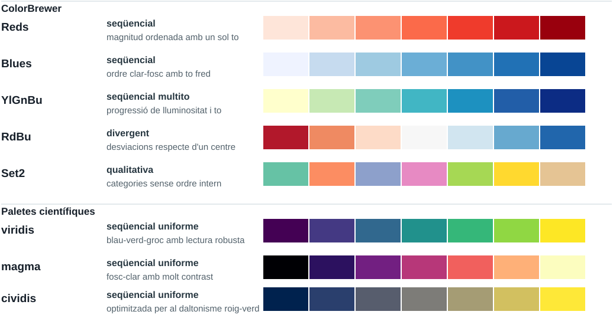

```{python}
from html import escape
from pathlib import Path

output = Path("assets/img/color-cartography/palette-reference-swatches.svg")
output.parent.mkdir(parents=True, exist_ok=True)

rows = [
    {
        "family": "ColorBrewer",
        "name": "Reds",
        "kind": "seqüencial",
        "use": "magnitud ordenada amb un sol to",
        "colors": ["#fee5d9", "#fcbba1", "#fc9272", "#fb6a4a", "#ef3b2c", "#cb181d", "#99000d"],
    },
    {
        "family": "ColorBrewer",
        "name": "Blues",
        "kind": "seqüencial",
        "use": "ordre clar-fosc amb to fred",
        "colors": ["#eff3ff", "#c6dbef", "#9ecae1", "#6baed6", "#4292c6", "#2171b5", "#084594"],
    },
    {
        "family": "ColorBrewer",
        "name": "YlGnBu",
        "kind": "seqüencial multito",
        "use": "progressió de lluminositat i to",
        "colors": ["#ffffcc", "#c7e9b4", "#7fcdbb", "#41b6c4", "#1d91c0", "#225ea8", "#0c2c84"],
    },
    {
        "family": "ColorBrewer",
        "name": "RdBu",
        "kind": "divergent",
        "use": "desviacions a banda i banda d'un centre",
        "colors": ["#b2182b", "#ef8a62", "#fddbc7", "#f7f7f7", "#d1e5f0", "#67a9cf", "#2166ac"],
    },
    {
        "family": "ColorBrewer",
        "name": "Set2",
        "kind": "qualitativa",
        "use": "categories sense ordre intern",
        "colors": ["#66c2a5", "#fc8d62", "#8da0cb", "#e78ac3", "#a6d854", "#ffd92f", "#e5c494"],
    },
    {
        "family": "Paletes científiques",
        "name": "viridis",
        "kind": "seqüencial uniforme",
        "use": "blau-verd-groc amb lectura robusta",
        "colors": ["#440154", "#443983", "#31688e", "#21918c", "#35b779", "#90d743", "#fde725"],
    },
    {
        "family": "Paletes científiques",
        "name": "magma",
        "kind": "seqüencial uniforme",
        "use": "fosc-clar amb molt contrast",
        "colors": ["#000004", "#2c115f", "#721f81", "#b73779", "#f1605d", "#feb078", "#fcfdbf"],
    },
    {
        "family": "Paletes científiques",
        "name": "cividis",
        "kind": "uniforme i CVD",
        "use": "optimitzada per al daltonisme roig-verd",
        "colors": ["#00224e", "#2a3f6d", "#575d6d", "#7d7c78", "#a59c74", "#d2c060", "#fee838"],
    },
]

width = 1180
height = 820
left = 74
kind_x = 252
swatch_x = 516
swatch_width = 78
swatch_height = 42
row_gap = 62
first_row_y = 144
section_gap = 34

svg = [
    f'<svg xmlns="http://www.w3.org/2000/svg" width="{width}" height="{height}" viewBox="0 0 {width} {height}" role="img" aria-labelledby="title desc">',
    '  <title id="title">Mostres de paletes cartogràfiques i científiques</title>',
    '  <desc id="desc">Comparació de paletes ColorBrewer, amb exemples seqüencials, divergents i qualitatius, i de mapes de color perceptualment uniformes com viridis, magma i cividis.</desc>',
    "  <defs>",
    "    <style>",
    "      .bg { fill: #ffffff; }",
    "      .rule { stroke: #d3dce0; stroke-width: 1.2; }",
    "      .title { font: 700 30px Arial, 'Liberation Sans', sans-serif; fill: #17202a; }",
    "      .subtitle { font: 16px Arial, 'Liberation Sans', sans-serif; fill: #52616b; }",
    "      .section { font: 700 17px Arial, 'Liberation Sans', sans-serif; fill: #17202a; }",
    "      .name { font: 700 19px Arial, 'Liberation Sans', sans-serif; fill: #17202a; }",
    "      .kind { font: 700 16px Arial, 'Liberation Sans', sans-serif; fill: #263640; }",
    "      .use { font: 15px Arial, 'Liberation Sans', sans-serif; fill: #52616b; }",
    "      .footer { font: 14px Arial, 'Liberation Sans', sans-serif; fill: #52616b; }",
    "      .swatch { stroke: #ffffff; stroke-width: 2; }",
    "      .frame { fill: none; stroke: #c7d2d7; stroke-width: 1.4; }",
    "    </style>",
    "  </defs>",
    '  <rect class="bg" width="1180" height="820"/>',
    '  <text x="590" y="50" text-anchor="middle" class="title">Paletes de referència per a mapes i dades</text>',
    '  <text x="590" y="78" text-anchor="middle" class="subtitle">El tipus de dada determina la funció de la paleta: ordre, desviació o categories.</text>',
]

last_family = None
row_index = 0
for row in rows:
    if row["family"] != last_family:
        section_y = first_row_y + row_index * row_gap
        if last_family is not None:
            section_y += section_gap
            first_row_y += section_gap
        svg.append(f'  <line x1="{left}" y1="{section_y - 24}" x2="{width - left}" y2="{section_y - 24}" class="rule"/>')
        svg.append(f'  <text x="{left}" y="{section_y - 6}" class="section">{escape(row["family"])}</text>')
        last_family = row["family"]

    y = first_row_y + row_index * row_gap
    svg.append(f'  <text x="{left}" y="{y + 26}" class="name">{escape(row["name"])}</text>')
    svg.append(f'  <text x="{kind_x}" y="{y + 19}" class="kind">{escape(row["kind"])}</text>')
    svg.append(f'  <text x="{kind_x}" y="{y + 42}" class="use">{escape(row["use"])}</text>')
    for i, color in enumerate(row["colors"]):
        x = swatch_x + i * swatch_width
        svg.append(f'  <rect x="{x}" y="{y}" width="{swatch_width}" height="{swatch_height}" class="swatch" fill="{color}"/>')
    svg.append(f'  <rect x="{swatch_x}" y="{y}" width="{swatch_width * len(row["colors"])}" height="{swatch_height}" class="frame"/>')
    row_index += 1

svg.append('  <text x="590" y="782" text-anchor="middle" class="footer">Mostres de 7 colors. Les paletes contínues s’han discretitzat per comparar-les en una mateixa figura.</text>')
svg.append("</svg>")

output.write_text("\n".join(svg) + "\n", encoding="utf-8")
```


