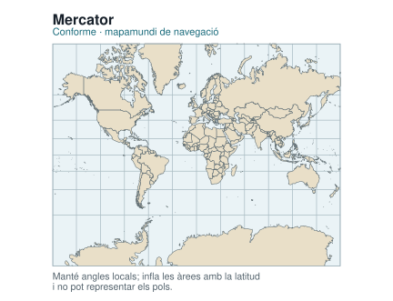
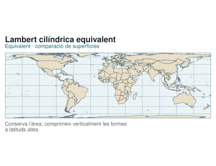
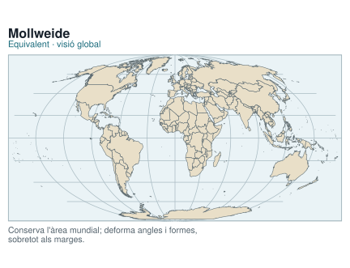
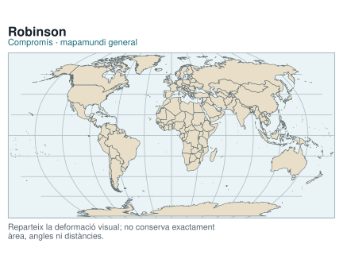
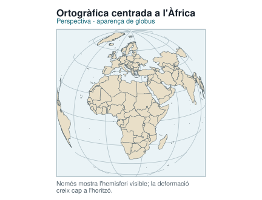
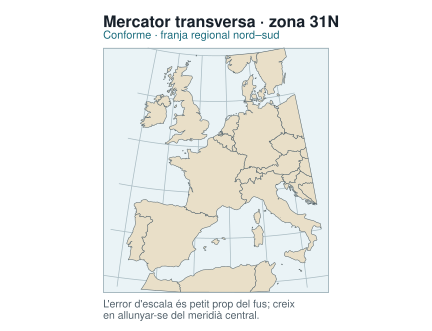
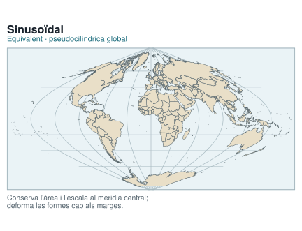

```{r}
find_project_root <- function(start) {
  path <- normalizePath(start, winslash = "/", mustWork = FALSE)
  repeat {
    if (file.exists(file.path(path, ".unaltraweb", "computations.yml"))) {
      return(path)
    }
    parent <- dirname(path)
    if (identical(parent, path)) {
      stop("Project root not found: missing .unaltraweb/computations.yml")
    }
    path <- parent
  }
}

xml_escape <- function(value) {
  value <- gsub("&", "&amp;", value, fixed = TRUE)
  value <- gsub("<", "&lt;", value, fixed = TRUE)
  value <- gsub(">", "&gt;", value, fixed = TRUE)
  value
}

add_svg_metadata <- function(path, title, description) {
  lines <- readLines(path, warn = FALSE, encoding = "UTF-8")
  svg_line <- grep("^<svg", lines)[1]
  stopifnot(!is.na(svg_line))
  lines[svg_line] <- sub(
    "<svg ",
    '<svg role="img" aria-labelledby="title desc" ',
    lines[svg_line],
    fixed = TRUE
  )
  metadata <- c(
    sprintf('  <title id="title">%s</title>', xml_escape(title)),
    sprintf('  <desc id="desc">%s</desc>', xml_escape(description))
  )
  lines <- append(lines, metadata, after = svg_line)
  writeLines(lines, path, useBytes = TRUE)
}

root <- find_project_root(getwd())
suppressPackageStartupMessages(library(ggplot2))
suppressPackageStartupMessages(library(sf))
sf::sf_use_s2(FALSE)

world <- sf::st_as_sf(maps::map("world", plot = FALSE, fill = TRUE))
world <- suppressWarnings(sf::st_set_crs(world, 4326))
world <- suppressWarnings(sf::st_make_valid(world))

make_bbox <- function(xmin, ymin, xmax, ymax) {
  sf::st_bbox(c(xmin = xmin, ymin = ymin, xmax = xmax, ymax = ymax), crs = sf::st_crs(4326))
}

make_projection_plot <- function(crs, bbox, lon_breaks, lat_breaks, title, subtitle, limitation) {
  local_world <- suppressWarnings(sf::st_crop(world, bbox))
  local_world <- suppressWarnings(sf::st_transform(local_world, crs, partial = TRUE))
  local_world <- local_world[!sf::st_is_empty(local_world), ]

  graticule <- sf::st_graticule(
    x = bbox,
    lon = lon_breaks,
    lat = lat_breaks,
    ndiscr = 350
  )
  graticule <- suppressWarnings(sf::st_transform(graticule, crs, partial = TRUE))
  graticule <- graticule[!sf::st_is_empty(graticule), ]

  ggplot() +
    geom_sf(data = graticule, color = "#a9bbc2", linewidth = 0.34) +
    geom_sf(data = local_world, fill = "#e9dfc8", color = "#56656c", linewidth = 0.24) +
    coord_sf(crs = crs, datum = NA, expand = FALSE) +
    labs(title = title, subtitle = subtitle, caption = limitation) +
    theme_void(base_family = "DejaVu Sans") +
    theme(
      plot.title = element_text(face = "bold", size = 16, color = "#17202a", hjust = 0),
      plot.subtitle = element_text(size = 11, color = "#17697a", hjust = 0, margin = margin(b = 7)),
      plot.caption = element_text(size = 10.5, color = "#52616b", hjust = 0, margin = margin(t = 7)),
      panel.background = element_rect(fill = "#eaf3f6", color = "#9fb2ba", linewidth = 0.6),
      panel.border = element_rect(fill = NA, color = "#9fb2ba", linewidth = 0.6),
      plot.background = element_rect(fill = "white", color = NA),
      plot.margin = margin(10, 10, 10, 10)
    )
}

global_bbox <- make_bbox(-179.9, -89, 179.9, 89)
mercator_bbox <- make_bbox(-179.9, -80, 179.9, 80)
regional_bbox <- make_bbox(-12, 34, 18, 60)

specifications <- list(
  list(
    file = "projection-gallery-mercator.svg",
    crs = "+proj=merc +lon_0=0 +datum=WGS84 +units=m +no_defs",
    bbox = mercator_bbox,
    lon = seq(-150, 150, by = 30), lat = seq(-60, 60, by = 20),
    title = "Mercator",
    subtitle = "Conforme · mapamundi de navegació",
    limitation = "Manté angles locals; infla les àrees amb la latitud\ni no pot representar els pols.",
    description = "Mapamundi de Mercator limitat a vuitanta graus de latitud. La retícula mostra l'augment de l'escala cap als pols."
  ),
  list(
    file = "projection-gallery-lambert-cylindrical-equal-area.svg",
    crs = "+proj=cea +lat_ts=0 +lon_0=0 +datum=WGS84 +units=m +no_defs",
    bbox = global_bbox,
    lon = seq(-150, 150, by = 30), lat = seq(-60, 60, by = 20),
    title = "Lambert cilíndrica equivalent",
    subtitle = "Equivalent · comparació de superfícies",
    limitation = "Conserva l'àrea; comprimeix verticalment les formes\na latituds altes.",
    description = "Mapamundi en projecció cilíndrica equivalent de Lambert. Les àrees relatives es conserven i les formes es deformen cap als pols."
  ),
  list(
    file = "projection-gallery-mollweide.svg",
    crs = "+proj=moll +lon_0=0 +datum=WGS84 +units=m +no_defs",
    bbox = global_bbox,
    lon = seq(-150, 150, by = 30), lat = seq(-60, 60, by = 20),
    title = "Mollweide",
    subtitle = "Equivalent · visió global",
    limitation = "Conserva l'àrea mundial; deforma angles i formes,\nsobretot als marges.",
    description = "Mapamundi el·líptic en projecció equivalent de Mollweide. Conserva les àrees però deforma formes i angles."
  ),
  list(
    file = "projection-gallery-robinson.svg",
    crs = "+proj=robin +lon_0=0 +datum=WGS84 +units=m +no_defs",
    bbox = global_bbox,
    lon = seq(-150, 150, by = 30), lat = seq(-60, 60, by = 20),
    title = "Robinson",
    subtitle = "Compromís · mapamundi general",
    limitation = "Reparteix la deformació visual; no conserva exactament\nàrea, angles ni distàncies.",
    description = "Mapamundi en projecció de compromís de Robinson. Cap propietat mètrica es conserva exactament a tot el mapa."
  ),
  list(
    file = "projection-gallery-orthographic-africa.svg",
    crs = "+proj=ortho +lat_0=15 +lon_0=20 +datum=WGS84 +units=m +no_defs",
    bbox = global_bbox,
    lon = seq(-150, 150, by = 30), lat = seq(-60, 60, by = 20),
    title = "Ortogràfica centrada a l'Àfrica",
    subtitle = "Perspectiva · aparença de globus",
    limitation = "Només mostra l'hemisferi visible; la deformació\ncreix cap a l'horitzó.",
    description = "Vista ortogràfica centrada a l'Àfrica. Imita una observació des de molt lluny i omet l'hemisferi posterior."
  ),
  list(
    file = "projection-gallery-transverse-mercator.svg",
    crs = sf::st_crs(25831),
    bbox = regional_bbox,
    lon = seq(-10, 15, by = 5), lat = seq(35, 60, by = 5),
    title = "Mercator transversa · zona 31N",
    subtitle = "Conforme · franja regional nord–sud",
    limitation = "L'error d'escala és petit prop del fus; creix\nen allunyar-se del meridià central.",
    description = "Mapa regional d'Europa occidental en ETRS89 UTM zona 31N. La projecció està pensada per a una franja estreta al voltant del fus 31."
  ),
  list(
    file = "projection-gallery-sinusoidal.svg",
    crs = "+proj=sinu +lon_0=0 +datum=WGS84 +units=m +no_defs",
    bbox = global_bbox,
    lon = seq(-150, 150, by = 30), lat = seq(-60, 60, by = 20),
    title = "Sinusoïdal",
    subtitle = "Equivalent · pseudocilíndrica global",
    limitation = "Conserva l'àrea i l'escala al meridià central;\ndeforma les formes cap als marges.",
    description = "Mapamundi en projecció sinusoïdal o Sanson-Flamsteed. Conserva les àrees, manté rectes els paral·lels i corba els meridians excepte el central."
  )
)

for (spec in specifications) {
  plot <- make_projection_plot(
    crs = spec$crs,
    bbox = spec$bbox,
    lon_breaks = spec$lon,
    lat_breaks = spec$lat,
    title = spec$title,
    subtitle = spec$subtitle,
    limitation = spec$limitation
  )
  output <- file.path(root, "assets/img/coordinate-systems", spec$file)
  svglite::svglite(output, width = 6, height = 4.6, bg = "white")
  print(plot)
  grDevices::dev.off()
  add_svg_metadata(output, spec$title, spec$description)
}
```








