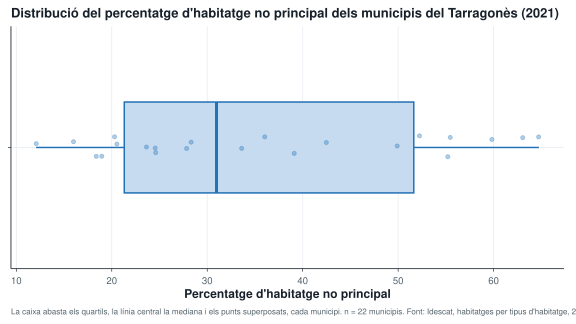

```{r}
find_project_root <- function(start) {
  path <- normalizePath(start, winslash = "/", mustWork = FALSE)
  repeat {
    if (file.exists(file.path(path, ".unaltraweb", "computations.yml"))) {
      return(path)
    }
    parent <- dirname(path)
    if (identical(parent, path)) {
      stop("Project root not found: missing .unaltraweb/computations.yml")
    }
    path <- parent
  }
}

root <- find_project_root(getwd())
indicators <- read.csv(
  file.path(root, "_practices/tigit-projecte-territorial/data/processed/municipal-indicators-tarragones-2021.csv"),
  fileEncoding = "UTF-8"
)
indicators <- indicators[order(indicators$housing_non_main_pct), ]

output <- file.path(root, "assets/img/data-visualization/boxplot-housing-non-main-tarragones-2021.svg")
dir.create(dirname(output), showWarnings = FALSE, recursive = TRUE)

svg(output, width = 8, height = 5.6, pointsize = 11)
par(mar = c(4, 4.5, 2.5, 1))
boxplot(
  indicators$housing_non_main_pct,
  horizontal = TRUE,
  range = 1.5,
  main = "Habitatge no principal als municipis del Tarragonès (2021)",
  xlab = "Percentatge d'habitatge no principal",
  ylab = "",
  col = "#c6dbef",
  border = "#2171b5",
  outcol = "#b2182b",
  outpch = 19,
  frame = FALSE
)

values <- indicators$housing_non_main_pct
points(
  values,
  rep(1, length(values)),
  col = "#2171b5",
  pch = 1,
  cex = 1.1,
  lwd = 1.4
)

mtext(
  paste("n =", nrow(indicators), "municipis"),
  side = 3,
  line = 0.2,
  adj = 0,
  cex = 0.85,
  col = "#52616b"
)
dev.off()
```

{: data-figure-width="48rem"}