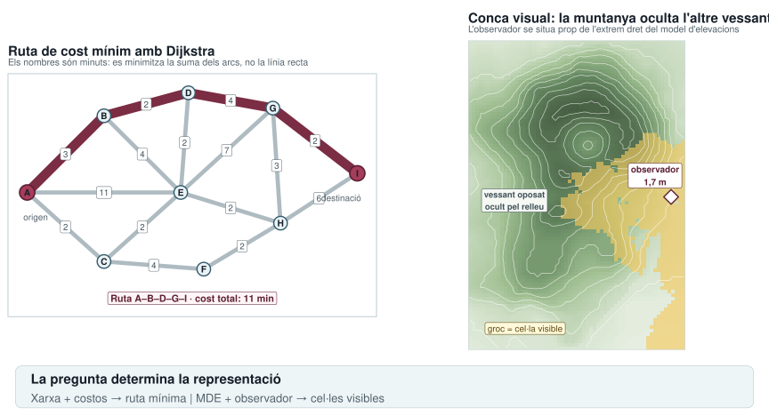

```{r}
find_project_root <- function(start) {
  path <- normalizePath(start, winslash = "/", mustWork = FALSE)
  repeat {
    if (file.exists(file.path(path, ".unaltraweb", "computations.yml"))) {
      return(path)
    }
    parent <- dirname(path)
    if (identical(parent, path)) {
      stop("Project root not found: missing .unaltraweb/computations.yml")
    }
    path <- parent
  }
}

xml_escape <- function(value) {
  value <- gsub("&", "&amp;", value, fixed = TRUE)
  value <- gsub("<", "&lt;", value, fixed = TRUE)
  value <- gsub(">", "&gt;", value, fixed = TRUE)
  value
}

add_svg_metadata <- function(path, title, description) {
  lines <- readLines(path, warn = FALSE, encoding = "UTF-8")
  svg_line <- grep("^<svg", lines)[1]
  stopifnot(!is.na(svg_line))
  lines[svg_line] <- sub(
    "<svg ",
    '<svg role="img" aria-labelledby="title desc" ',
    lines[svg_line],
    fixed = TRUE
  )
  metadata <- c(
    sprintf('  <title id="title">%s</title>', xml_escape(title)),
    sprintf('  <desc id="desc">%s</desc>', xml_escape(description))
  )
  lines <- append(lines, metadata, after = svg_line)
  writeLines(lines, path, useBytes = TRUE)
}

dijkstra <- function(nodes, edges, start, goal) {
  ids <- nodes$id
  distance <- stats::setNames(rep(Inf, length(ids)), ids)
  previous <- stats::setNames(rep(NA_character_, length(ids)), ids)
  visited <- stats::setNames(rep(FALSE, length(ids)), ids)
  distance[start] <- 0

  repeat {
    candidates <- distance
    candidates[visited] <- Inf
    current <- names(which.min(candidates))
    if (!length(current) || is.infinite(candidates[current]) || current == goal) {
      break
    }
    visited[current] <- TRUE

    incident <- edges[edges$from == current | edges$to == current, ]
    for (i in seq_len(nrow(incident))) {
      neighbor <- if (incident$from[i] == current) incident$to[i] else incident$from[i]
      alternative <- distance[current] + incident$minutes[i]
      if (alternative < distance[neighbor]) {
        distance[neighbor] <- alternative
        previous[neighbor] <- current
      }
    }
  }

  path <- goal
  while (path[1] != start && !is.na(previous[path[1]])) {
    path <- c(previous[path[1]], path)
  }
  if (path[1] != start) {
    stop("No path found")
  }
  list(path = unname(path), cost = unname(distance[goal]))
}

root <- find_project_root(getwd())
suppressPackageStartupMessages(library(ggplot2))
suppressPackageStartupMessages(library(terra))

nodes <- data.frame(
  id = LETTERS[1:9],
  x = c(0, 1, 1, 2.1, 2, 2.3, 3.2, 3.3, 4.3),
  y = c(1, 2, 0.1, 2.3, 1, 0, 2.1, 0.6, 1.25)
)
edges <- data.frame(
  from = c("A", "A", "A", "B", "B", "C", "C", "D", "D", "E", "E", "F", "G", "G", "H"),
  to = c("B", "C", "E", "D", "E", "E", "F", "E", "G", "G", "H", "H", "H", "I", "I"),
  minutes = c(3, 2, 11, 2, 4, 2, 4, 2, 4, 7, 2, 2, 3, 2, 6)
)

route <- dijkstra(nodes, edges, "A", "I")
route_keys <- paste(
  pmin(route$path[-length(route$path)], route$path[-1]),
  pmax(route$path[-length(route$path)], route$path[-1]),
  sep = "–"
)

edge_plot <- merge(edges, nodes, by.x = "from", by.y = "id")
names(edge_plot)[names(edge_plot) %in% c("x", "y")] <- c("x_from", "y_from")
edge_plot <- merge(edge_plot, nodes, by.x = "to", by.y = "id")
names(edge_plot)[names(edge_plot) %in% c("x", "y")] <- c("x_to", "y_to")
edge_plot$key <- paste(pmin(edge_plot$from, edge_plot$to), pmax(edge_plot$from, edge_plot$to), sep = "–")
edge_plot$selected <- edge_plot$key %in% route_keys
edge_plot$label_x <- (edge_plot$x_from + edge_plot$x_to) / 2
edge_plot$label_y <- (edge_plot$y_from + edge_plot$y_to) / 2

stopifnot(
  identical(route$path, c("A", "B", "D", "G", "I")),
  route$cost == 11,
  sum(edge_plot$selected) == 4
)

network_plot <- ggplot() +
  geom_segment(
    data = edge_plot,
    aes(x = x_from, y = y_from, xend = x_to, yend = y_to),
    color = "#aebbc1",
    linewidth = 2.2,
    lineend = "round"
  ) +
  geom_segment(
    data = edge_plot[edge_plot$selected, ],
    aes(x = x_from, y = y_from, xend = x_to, yend = y_to),
    color = "#7b2d43",
    linewidth = 5,
    lineend = "round"
  ) +
  geom_label(
    data = edge_plot,
    aes(x = label_x, y = label_y, label = minutes),
    family = "DejaVu Sans",
    size = 3.4,
    label.size = 0.2,
    label.padding = grid::unit(1.1, "mm"),
    color = "#40515a",
    fill = "white"
  ) +
  geom_point(data = nodes, aes(x, y), shape = 21, size = 6.5, stroke = 1, color = "#365b6d", fill = "#eaf3f6") +
  geom_point(data = nodes[nodes$id %in% c("A", "I"), ], aes(x, y), shape = 21, size = 7.2, stroke = 1.2, color = "#5e2035", fill = "#a63d5a") +
  geom_text(data = nodes, aes(x, y, label = id), family = "DejaVu Sans", fontface = "bold", size = 3.6, color = "#17202a") +
  annotate("text", x = -0.05, y = 0.68, label = "origen", hjust = 0, family = "DejaVu Sans", size = 3.5, color = "#52616b") +
  annotate("text", x = 4.35, y = 0.93, label = "destinació", hjust = 1, family = "DejaVu Sans", size = 3.5, color = "#52616b") +
  annotate("label", x = 2.15, y = -0.38, label = "Ruta A–B–D–G–I · cost total: 11 min", family = "DejaVu Sans", fontface = "bold", size = 3.8, color = "#5e2035", fill = "#fff5f7", label.size = 0.25) +
  coord_equal(xlim = c(-0.25, 4.55), ylim = c(-0.62, 2.55), expand = FALSE) +
  labs(
    title = "Ruta de cost mínim amb Dijkstra",
    subtitle = "Els nombres són minuts: es minimitza la suma dels arcs, no la línia recta"
  ) +
  theme_void(base_family = "DejaVu Sans") +
  theme(
    plot.title = element_text(face = "bold", size = 15, color = "#17202a", hjust = 0),
    plot.subtitle = element_text(size = 10.5, color = "#52616b", hjust = 0, margin = margin(b = 7)),
    panel.border = element_rect(fill = NA, color = "#ccd7dc", linewidth = 0.6),
    plot.margin = margin(9, 9, 9, 9)
  )

elevation <- datasets::volcano
cell_size <- 10
dem <- terra::rast(
  nrows = nrow(elevation),
  ncols = ncol(elevation),
  xmin = 0,
  xmax = ncol(elevation) * cell_size,
  ymin = 0,
  ymax = nrow(elevation) * cell_size
)
terra::values(dem) <- as.vector(t(elevation))
names(dem) <- "elevation"

observer <- c(570, 430)
visible <- terra::viewshed(
  dem,
  loc = observer,
  observer = 1.7,
  target = 1.7,
  curvcoef = 0,
  output = "yes/no"
)
names(visible) <- "visible"
terrain <- as.data.frame(c(dem, visible), xy = TRUE, na.rm = FALSE)
terrain$visible <- as.logical(terrain$visible)
observer_elevation <- terra::extract(dem, matrix(observer, nrow = 1))[[1]]

stopifnot(
  is.finite(observer_elevation),
  observer[1] > 0.85 * terra::xmax(dem),
  any(terrain$visible, na.rm = TRUE),
  any(!terrain$visible, na.rm = TRUE),
  any(!terrain$visible[terrain$x < 0.35 * terra::xmax(dem)], na.rm = TRUE)
)

viewshed_plot <- ggplot(terrain, aes(x, y)) +
  geom_raster(aes(fill = elevation)) +
  geom_raster(data = terrain[terrain$visible %in% TRUE, ], fill = "#f4c95d", alpha = 0.63) +
  geom_contour(aes(z = elevation), breaks = seq(100, 190, by = 10), color = "#ffffffb8", linewidth = 0.3) +
  annotate("point", x = observer[1], y = observer[2], shape = 23, size = 5.5, stroke = 1, color = "#5e2035", fill = "#ffffff") +
  annotate("label", x = observer[1] - 45, y = observer[2] + 60, label = "observador\n1,7 m", family = "DejaVu Sans", fontface = "bold", size = 3.5, color = "#5e2035", fill = "white", label.size = 0.25) +
  annotate("label", x = 130, y = 420, label = "vessant oposat\nocult pel relleu", family = "DejaVu Sans", fontface = "bold", size = 3.3, color = "#40515a", fill = "#f5f8f3", label.size = 0.25) +
  annotate("label", x = 160, y = 60, label = "groc = cel·la visible", family = "DejaVu Sans", size = 3.5, color = "#5e4a12", fill = "#fff9db", label.size = 0.25) +
  scale_fill_gradientn(colors = c("#e7efe2", "#9fbf91", "#63865f", "#475d43"), guide = "none") +
  coord_equal(expand = FALSE) +
  labs(
    title = "Conca visual: la muntanya oculta l'altre vessant",
    subtitle = "L'observador se situa prop de l'extrem dret del model d'elevacions"
  ) +
  theme_void(base_family = "DejaVu Sans") +
  theme(
    plot.title = element_text(face = "bold", size = 15, color = "#17202a", hjust = 0),
    plot.subtitle = element_text(size = 10.5, color = "#52616b", hjust = 0, margin = margin(b = 7)),
    panel.border = element_rect(fill = NA, color = "#ccd7dc", linewidth = 0.6),
    plot.margin = margin(9, 9, 9, 9)
  )

output <- file.path(root, "assets/img/gis/gis-analysis-examples.svg")
svglite::svglite(output, width = 12, height = 6.5, bg = "white")
grid::grid.newpage()
layout <- grid::grid.layout(
  nrow = 2,
  ncol = 2,
  heights = grid::unit(c(0.86, 0.14), "npc"),
  widths = grid::unit(c(1, 1), "null")
)
grid::pushViewport(grid::viewport(layout = layout))
print(network_plot, vp = grid::viewport(layout.pos.row = 1, layout.pos.col = 1))
print(viewshed_plot, vp = grid::viewport(layout.pos.row = 1, layout.pos.col = 2))

footer <- grid::viewport(layout.pos.row = 2, layout.pos.col = 1:2)
grid::grid.roundrect(
  x = 0.5,
  y = 0.5,
  width = 0.96,
  height = 0.72,
  r = grid::unit(2.5, "mm"),
  vp = footer,
  gp = grid::gpar(fill = "#eef5f7", col = "#b8cbd2", lwd = 0.8)
)
grid::grid.text(
  "La pregunta determina la representació",
  x = grid::unit(0.04, "npc"),
  y = grid::unit(0.64, "npc"),
  just = c("left", "center"),
  vp = footer,
  gp = grid::gpar(fontfamily = "DejaVu Sans", fontsize = 15, fontface = "bold", col = "#17202a")
)
grid::grid.text(
  "Xarxa + costos → ruta mínima  |  MDE + observador → cel·les visibles",
  x = grid::unit(0.04, "npc"),
  y = grid::unit(0.31, "npc"),
  just = c("left", "center"),
  vp = footer,
  gp = grid::gpar(fontfamily = "DejaVu Sans", fontsize = 13, col = "#52616b")
)
grDevices::dev.off()

add_svg_metadata(
  output,
  "Ruta mínima i conca visual com a exemples d'anàlisi SIG",
  "A l'esquerra, l'algorisme de Dijkstra selecciona una ruta de cost total mínim sobre una xarxa amb temps de recorregut. A la dreta, una conca visual situa l'observador prop del marge dret del model d'elevacions volcano i mostra com la muntanya oculta el vessant oposat."
)
```


