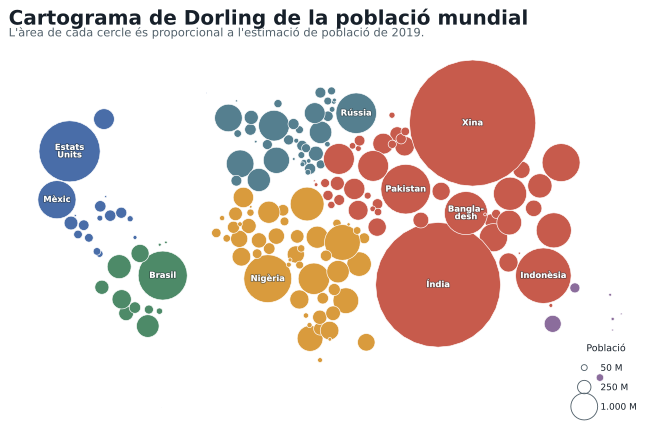
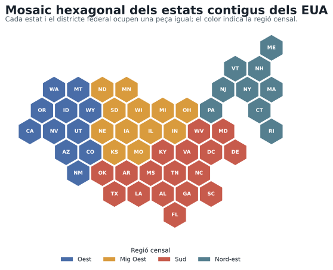

```{python}
from importlib.metadata import version
from pathlib import Path

import matplotlib as mpl
import matplotlib.patheffects as path_effects
import matplotlib.pyplot as plt
import numpy as np
from matplotlib.lines import Line2D
from matplotlib.patches import Patch

from carto_flow.data import load_us_states, load_world
from carto_flow.symbol_cartogram import create_symbol_cartogram
from carto_flow.symbol_cartogram.presets import preset_dorling, preset_tile_map


def find_project_root(start: Path) -> Path:
    path = start.resolve()
    for candidate in (path, *path.parents):
        if (candidate / ".unaltraweb" / "computations.yml").exists():
            return candidate
    raise RuntimeError("Project root not found: missing .unaltraweb/computations.yml")


def add_svg_metadata(path: Path, title: str, description: str) -> None:
    svg = path.read_text(encoding="utf-8")
    svg = svg.replace("<svg ", '<svg role="img" aria-labelledby="title desc" ', 1)
    opening_tag_end = svg.index(">", svg.index("<svg")) + 1
    metadata = (
        f'\n  <title id="title">{title}</title>'
        f'\n  <desc id="desc">{description}</desc>'
    )
    svg = svg[:opening_tag_end] + metadata + svg[opening_tag_end:]
    path.write_text("\n".join(line.rstrip() for line in svg.splitlines()) + "\n", encoding="utf-8")


def save_figure(fig, path: Path, title: str, description: str) -> None:
    fig.savefig(
        path,
        format="svg",
        metadata={"Date": None},
        facecolor="white",
        bbox_inches="tight",
        pad_inches=0.12,
    )
    plt.close(fig)
    add_svg_metadata(path, title, description)


root = find_project_root(Path.cwd())
output_dir = root / "assets" / "img" / "thematic-cartography"
output_dir.mkdir(parents=True, exist_ok=True)

assert version("carto-flow") == "1.1.2"
np.random.seed(20260827)

mpl.rcParams.update(
    {
        "font.family": ["Arial", "Liberation Sans", "DejaVu Sans", "sans-serif"],
        "font.size": 11,
        "axes.titlecolor": "#17202a",
        "text.color": "#17202a",
        "svg.fonttype": "path",
        "svg.hashsalt": "tigit-carto-flow-examples",
    }
)

# The package bundles this Natural Earth dataset; no network access is needed.
world = load_world()
world = world.loc[(world["name"] != "Antarctica") & (world["pop_est"] > 0)].copy()
world = world.to_crs("EPSG:8857").reset_index(drop=True)

continent_colors = {
    "Africa": "#d99b3d",
    "Asia": "#c75b4c",
    "Europe": "#557f8f",
    "North America": "#496da8",
    "Oceania": "#8b6d9c",
    "South America": "#4d8a68",
    "Seven seas (open ocean)": "#9aa7ad",
}
world["facecolor"] = world["continent"].map(continent_colors).fillna("#9aa7ad")

dorling = create_symbol_cartogram(
    world,
    "pop_est",
    size_normalization="total",
    show_progress=False,
    **preset_dorling(),
)
assert len(dorling.symbols) == len(world)
assert dorling.symbols.geometry.is_valid.all()
area_per_person = dorling.symbols.geometry.area / world["pop_est"]
assert np.allclose(area_per_person, area_per_person.iloc[0])

label_names = {
    "China": "Xina",
    "India": "Índia",
    "United States of America": "Estats\nUnits",
    "Indonesia": "Indonèsia",
    "Pakistan": "Pakistan",
    "Brazil": "Brasil",
    "Nigeria": "Nigèria",
    "Bangladesh": "Bangla-\ndesh",
    "Russia": "Rússia",
    "Mexico": "Mèxic",
}

fig, ax = plt.subplots(figsize=(9.6, 7.2))
fig.patch.set_facecolor("white")
ax.set_facecolor("#f7f4ed")
dorling.symbols.plot(
    ax=ax,
    color=world["facecolor"],
    edgecolor="white",
    linewidth=0.65,
)

for index, label in label_names.items():
    row = world.index[world["name"] == index]
    if len(row) != 1:
        continue
    point = dorling.symbols.geometry.iloc[row[0]].centroid
    text = ax.text(
        point.x,
        point.y,
        label,
        ha="center",
        va="center",
        color="white",
        fontsize=8.4,
        fontweight="bold",
        linespacing=0.9,
        zorder=3,
    )
    text.set_path_effects([path_effects.withStroke(linewidth=1.6, foreground="#26323888")])

ax.set_title(
    "Cartograma de Dorling de la població mundial",
    loc="left",
    fontsize=20,
    fontweight="bold",
    pad=18,
)
ax.text(
    0,
    1.01,
    "L'àrea de cada cercle és proporcional a l'estimació de població de 2019.",
    transform=ax.transAxes,
    ha="left",
    va="bottom",
    fontsize=11.5,
    color="#52616b",
)
ax.set_axis_off()

continent_handles = [
    Patch(facecolor=color, edgecolor="none", label=label)
    for label, color in [
        ("Àfrica", continent_colors["Africa"]),
        ("Àsia", continent_colors["Asia"]),
        ("Europa", continent_colors["Europe"]),
        ("Amèrica del Nord", continent_colors["North America"]),
        ("Amèrica del Sud", continent_colors["South America"]),
        ("Oceania", continent_colors["Oceania"]),
    ]
]
continent_legend = ax.legend(
    handles=continent_handles,
    loc="upper center",
    bbox_to_anchor=(0.5, -0.015),
    ncol=3,
    frameon=False,
    fontsize=9.5,
    title="Continent",
    title_fontsize=10,
)
ax.add_artist(continent_legend)

population_handles = [
    Line2D(
        [],
        [],
        marker="o",
        linestyle="none",
        markerfacecolor="none",
        markeredgecolor="#52616b",
        markeredgewidth=0.9,
        markersize=6 * np.sqrt(value / 50),
        label=f"{value:,} M".replace(",", "."),
    )
    for value in (50, 250, 1000)
]
ax.legend(
    handles=population_handles,
    loc="lower right",
    bbox_to_anchor=(0.99, 0.015),
    frameon=False,
    fontsize=9,
    title="Població",
    title_fontsize=9.5,
    labelspacing=1.2,
)
fig.subplots_adjust(left=0.025, right=0.985, top=0.88, bottom=0.14)

dorling_output = output_dir / "world-population-dorling-cartogram.svg"
save_figure(
    fig,
    dorling_output,
    "Cartograma de Dorling de la població mundial",
    "Els països es representen amb cercles d'àrea proporcional a la població estimada de 2019. El color identifica el continent i les deu poblacions més grans estan etiquetades.",
)

# The package also bundles Natural Earth state boundaries and tile-map presets.
states = load_us_states()
states = states.loc[~states["iso_3166_2"].isin(["US-AK", "US-HI"])].copy()
states = states.to_crs("EPSG:5070").reset_index(drop=True)

region_colors = {
    "Midwest": "#d99b3d",
    "Northeast": "#557f8f",
    "South": "#c75b4c",
    "West": "#496da8",
}
states["facecolor"] = states["region"].map(region_colors)

tile_map = create_symbol_cartogram(
    states,
    show_progress=False,
    **preset_tile_map(),
)
assert len(tile_map.symbols) == len(states) == 49
assert tile_map.symbols.geometry.is_valid.all()
assert np.allclose(
    tile_map.symbols.geometry.area,
    tile_map.symbols.geometry.area.iloc[0],
)

fig, ax = plt.subplots(figsize=(9.6, 6.9))
fig.patch.set_facecolor("white")
ax.set_facecolor("#f7f4ed")
tile_map.symbols.plot(
    ax=ax,
    color=states["facecolor"],
    edgecolor="white",
    linewidth=1.15,
)

for geometry, abbreviation in zip(tile_map.symbols.geometry, states["postal"], strict=True):
    point = geometry.centroid
    ax.text(
        point.x,
        point.y,
        abbreviation,
        ha="center",
        va="center",
        color="white",
        fontsize=8.5,
        fontweight="bold",
    )

ax.set_title(
    "Mosaic hexagonal dels estats contigus dels EUA",
    loc="left",
    fontsize=20,
    fontweight="bold",
    pad=18,
)
ax.text(
    0,
    1.01,
    "Cada estat i el districte federal ocupen una peça igual; el color indica la regió censal.",
    transform=ax.transAxes,
    ha="left",
    va="bottom",
    fontsize=11.5,
    color="#52616b",
)
ax.set_axis_off()

region_handles = [
    Patch(facecolor=color, edgecolor="none", label=label)
    for label, color in [
        ("Oest", region_colors["West"]),
        ("Mig Oest", region_colors["Midwest"]),
        ("Sud", region_colors["South"]),
        ("Nord-est", region_colors["Northeast"]),
    ]
]
ax.legend(
    handles=region_handles,
    loc="upper center",
    bbox_to_anchor=(0.5, -0.02),
    ncol=4,
    frameon=False,
    fontsize=10,
    title="Regió censal",
    title_fontsize=10.5,
)
fig.subplots_adjust(left=0.025, right=0.985, top=0.86, bottom=0.14)

tile_output = output_dir / "us-states-hex-tile-cartogram.svg"
save_figure(
    fig,
    tile_output,
    "Mosaic hexagonal dels estats contigus dels Estats Units",
    "Cada estat contigu i el districte de Colúmbia es representen amb un hexàgon de la mateixa àrea. Les sigles identifiquen les unitats i el color diferencia les quatre regions censals.",
)
```




