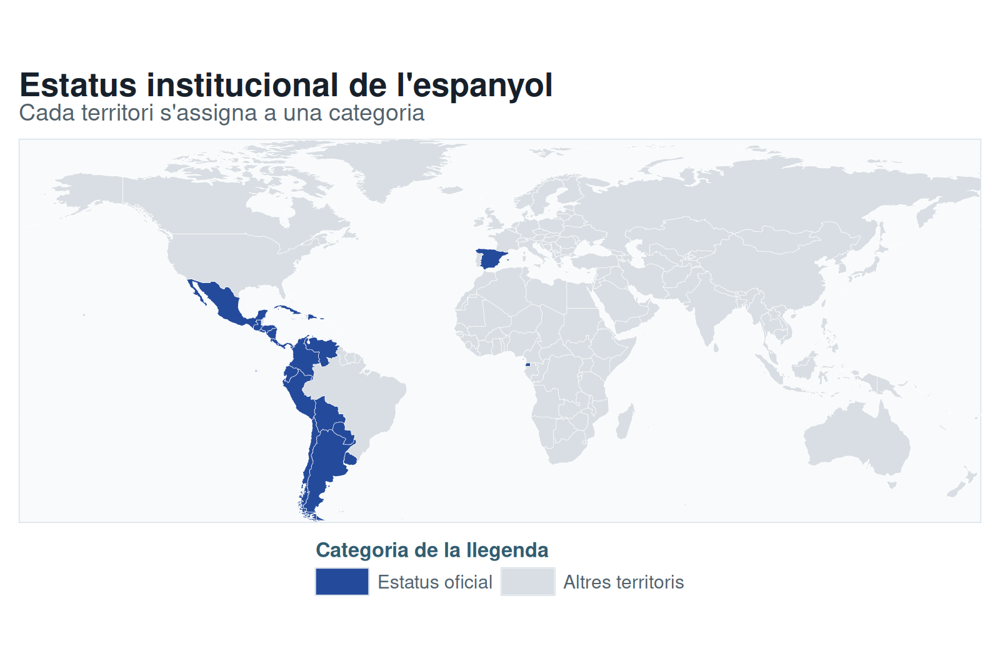
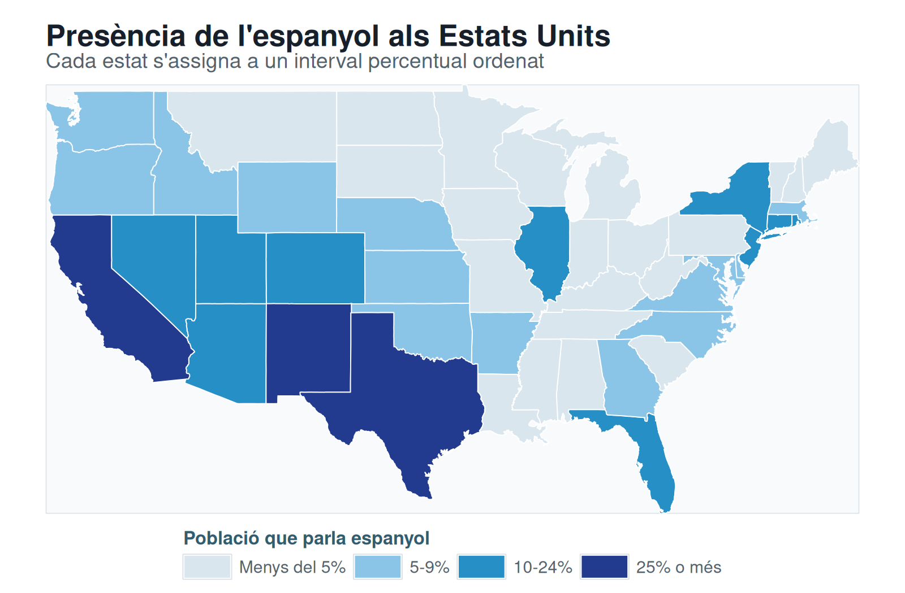

```{r}
find_project_root <- function(start) {
  path <- normalizePath(start, winslash = "/", mustWork = FALSE)
  repeat {
    if (file.exists(file.path(path, ".unaltraweb", "computations.yml"))) {
      return(path)
    }
    parent <- dirname(path)
    if (identical(parent, path)) {
      stop("Project root not found: missing .unaltraweb/computations.yml")
    }
    path <- parent
  }
}

save_png <- function(plot, path, width = 1600, height = 1050) {
  grDevices::png(
    filename = path,
    width = width,
    height = height,
    res = 180,
    type = "cairo-png",
    bg = "white"
  )
  print(plot)
  grDevices::dev.off()
}

root <- find_project_root(getwd())
legacy_source <- file.path(root, "assets/img/legacy/spanish-speakers-choropleth-map.png")
stopifnot(file.exists(legacy_source))

suppressPackageStartupMessages(library(ggplot2))
suppressPackageStartupMessages(library(sf))
sf::sf_use_s2(FALSE)

base_theme <- theme_void(base_family = "DejaVu Sans") +
  theme(
    plot.title = element_text(face = "bold", size = 21, color = "#17202a", hjust = 0),
    plot.subtitle = element_text(size = 15, color = "#52616b", hjust = 0, margin = margin(b = 8)),
    plot.background = element_rect(fill = "white", color = NA),
    panel.background = element_rect(fill = "#f8fafc", color = "#d8e0e6", linewidth = 0.55),
    plot.margin = margin(12, 12, 10, 12),
    legend.position = "bottom",
    legend.title = element_text(size = 13, face = "bold", color = "#315d70"),
    legend.text = element_text(size = 12, color = "#52616b"),
    legend.key.width = grid::unit(12, "mm"),
    legend.margin = margin(t = 5)
  )

world <- sf::st_as_sf(maps::map("world", plot = FALSE, fill = TRUE))
world <- suppressWarnings(sf::st_set_crs(world, 4326))
world <- suppressWarnings(sf::st_make_valid(world))
world <- suppressWarnings(sf::st_crop(
  world,
  sf::st_bbox(c(xmin = -179.9, ymin = -58, xmax = 179.9, ymax = 85), crs = sf::st_crs(4326))
))

official_countries <- c(
  "Argentina", "Bolivia", "Chile", "Colombia", "Costa Rica", "Cuba",
  "Dominican Republic", "Ecuador", "El Salvador", "Equatorial Guinea",
  "Guatemala", "Honduras", "Mexico", "Nicaragua", "Panama", "Paraguay",
  "Peru", "Puerto Rico", "Spain", "Uruguay", "Venezuela"
)
world$country <- sub(":.*", "", world$ID)
world$status <- factor(
  ifelse(world$country %in% official_countries, "Estatus oficial", "Altres territoris"),
  levels = c("Estatus oficial", "Altres territoris")
)

qualitative_map <- ggplot(world) +
  geom_sf(aes(fill = status), color = "white", linewidth = 0.12) +
  scale_fill_manual(
    values = c("Estatus oficial" = "#244a9b", "Altres territoris" = "#d8dee3"),
    name = "Categoria de la llegenda",
    drop = FALSE
  ) +
  coord_sf(datum = NA, expand = FALSE) +
  labs(
    title = "Estatus institucional de l'espanyol",
    subtitle = "Cada territori s'assigna a una categoria"
  ) +
  base_theme +
  guides(fill = guide_legend(title.position = "top", nrow = 1, byrow = TRUE))

states <- sf::st_as_sf(maps::map("state", plot = FALSE, fill = TRUE))
states <- suppressWarnings(sf::st_set_crs(states, 4326))
states <- suppressWarnings(sf::st_make_valid(states))

high_share <- c("california", "new mexico", "texas")
medium_share <- c(
  "arizona", "colorado", "connecticut", "florida", "illinois", "nevada",
  "new jersey", "new york", "rhode island", "utah"
)
lower_share <- c(
  "arkansas", "delaware", "district of columbia", "georgia", "idaho",
  "kansas", "maryland", "massachusetts", "nebraska", "north carolina",
  "oklahoma", "oregon", "virginia", "washington", "wyoming"
)

states$share_class <- "Menys del 5%"
states$share_class[states$ID %in% lower_share] <- "5-9%"
states$share_class[states$ID %in% medium_share] <- "10-24%"
states$share_class[states$ID %in% high_share] <- "25% o més"
states$share_class <- factor(
  states$share_class,
  levels = c("Menys del 5%", "5-9%", "10-24%", "25% o més")
)

quantitative_map <- ggplot(states) +
  geom_sf(aes(fill = share_class), color = "white", linewidth = 0.35) +
  scale_fill_manual(
    values = c(
      "Menys del 5%" = "#d9e6ed",
      "5-9%" = "#8ac5e8",
      "10-24%" = "#268fc5",
      "25% o més" = "#233b8f"
    ),
    name = "Població que parla espanyol",
    drop = FALSE
  ) +
  coord_sf(datum = NA, expand = FALSE) +
  labs(
    title = "Presència de l'espanyol als Estats Units",
    subtitle = "Cada estat s'assigna a un interval percentual ordenat"
  ) +
  base_theme +
  guides(fill = guide_legend(title.position = "top", nrow = 1, byrow = TRUE))

qualitative_output <- file.path(
  root,
  "assets/img/thematic-cartography/spanish-speakers-qualitative-map.png"
)
quantitative_output <- file.path(
  root,
  "assets/img/thematic-cartography/spanish-speakers-quantitative-map.png"
)
dir.create(dirname(qualitative_output), showWarnings = FALSE, recursive = TRUE)
save_png(qualitative_map, qualitative_output)
save_png(quantitative_map, quantitative_output)
```




